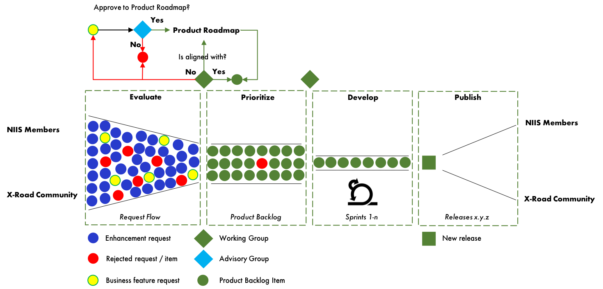

# X-Road Development Model

#### VERSION CONTROL
| version no.	 | what has been done	| date/person
| ---- | ---- | ---- |
| 0.1	| Initial draft.	| 18.3.18 / PK

The purpose of this document is to describe the change management process of the X-Road software. The process
must ensure the quality of the source code, the application of best practices and the ability to manage software
changes to be applied to local production environments. The process is controlled by the Nordic Institute for Interoperability Solutions (NIIS).

Non-Functional Requirements are described in the [X-Road Non-Functional Requirements](NFR.md) document. The workflow policy based on this document is described in the [Workflow Policy](WORKFLOW.md) document.

## 1 Roles and Responsibilities

The change management process includes the following roles and responsibilities:

* NIIS
  * maintains product roadmap and product backlog
  * maintains the master source code repository
  * maintains Non Functional Requirements
  * reviews and accepts / rejects contributions
  * organizes and facilitates Advisory Group and Working Group meetings
  * schedules releases
  * coordinates daily work
* NIIS Member
  * nominates representatives to the Advisory Group
  * participates in the Working Group
  * submits business feature and enhancement requests
  * submits code contributions including required documentation
* Advisory Group  
  * accepts / rejects business feature requests
  * prioritizes product backlog
* Working Group
  * prioritizes product backlog
  * accepts / rejects enhancement requests
* X-Road Community
  * submits business feature and enhancement requests
  * submits code contributions including required documentation.

## 2 Change Management

The Product Roadmap is a plan that outlines the flow of new business features
needed to satisfy the needs of the NIIS members. The roadmap helps reach a
consensus about future developments and it provides a framework to help plan
and coordinate upcoming releases. The X-Road roadmap takes into consideration
scoped functionality and X-Road production compatibility. Changes to the Product
Roadmap are approved by the Advisory Board.

The Product Backlog contains fine grained technical items derived from the
Product Roadmap items and enhancement requests. The Product Backlog is prioritized
by the Advisory Group and Working Group.

X-Road Product Roadmap and Product Backlog are owned and managed by the NIIS.

Diagram 1. Change management.

The change management process consists of four phases:

* **evaluate** - collect new feature and enhancement requests and select the best ones for development
* **prioritize** – maintain and prioritize product backlog
* **develop** – agile development of features requested by the NIIS members
* **publish** – Publish and distribute new releases.

### 2.1 Evaluate

The NIIS members and X-Road Community may submit business feature requests and
enhancement requests that are evaluated by the Working Group. New business feature
requests are submitted to the Advisory Group for approval. Requests must be
aligned with the X-Road Product Roadmap and the requests that are not aligned
with the Product Roadmap are rejected or submitted to the Advisory Group for
approval. In addition, the requests that are too costly, not really essential,
etc. are eliminated. The requests that pass the evaluation enter the Product
Backlog.

### 2.2 Prioritize

Product Backlog is a prioritized list of requests that have passed the evaluation.
However, requests can be eliminated from the Product Backlog. During prioritize
phase requests are defined in more detailed level and they are broken down into
technical items. Dependencies between different items are analyzed and documented,
and prioritization is updated accordingly. Items on top of the backlog are the
top candidates for entering the sprint backlog of the next sprint. The NIIS is
responsible for maintaining the Product Backlog and prioritizing it together
with the Advisory Group and Working Group.

### 2.3 Develop

Items are implemented in sprints using agile software development methods. Each
sprint, the implemented items are picked from the Product Backlog on top of its
stack. The development is done by the NIIS’s development teams. The NIIS is
responsible for managing and coordinating the daily work of the development teams.
The NIIS’s development practices are followed ([Workflow Policy]((WORKFLOW.md)),
[NFR](NFR.md)). The NIIS is responsible for the whole develop phase.

In addition, the NIIS members and X-Road community may contribute to the
development. Also then, the NIIS’s development practices must be followed
([Workflow Policy](WORKFLOW.md), [NFR](NFR.md)). The contributions must be
approved upfront by the Working Group and they must fulfill the acceptance
criteria for contributions.

### 2.4 Publish

New versions of X-Road are published three times a year based on a fixed
release schedule:

* winter (February)
* spring (May)
* autumn (October).

The determination of what sequence a release will be identified with will be
determined by the NIIS. A basic software rule of thumb will be as follows.

*	Major Release (X.0) will be used for significant jumps in functionality such
as changing the framework which could cause incompatibility with interfacing
systems or new modules/components.
*	Minor Release (X.X) will be used when only minor features or significant
fixes have been added.
*	Revision Release (X.X.X) is used and incremented when minor bugs are fixed.

At times the release sequence may jump multiple minor versions at a time to
indicate significant features have been added, but are not enough to warrant
incrementing a major version number. See Non Functional Requirements
[X-Road Non-Functional Requirements](NFR.md) document for more detailed
information on version numbering.

The NIIS is responsible for publishing new versions and distributing installation
packages to members and X-Road Community. The NIIS members and X-Road Community
are responsible for updating their instances and coordinating the upgrade
process within their ecosystems.

Latest version and two earlier versions are officially supported by the NIIS.

#### 2.4.1 Version Compatibility

Major versions of X-Road are intended to be longlived versions of the software
which consist of numerous minor versions. The decision to create a new major
version of X-Road will be the result of the need for major changes which cannot
be successfully implemented without breaking version compatibility.

#### References
- [[X-Road Non-Functional Requirements](NFR.md)] X-Road Non-Functional Requirements.
- [[Workflow Policy](https://github.com/e-gov/Open-Workflow/blob/master/WORKFLOW.md)] Workflow Policy.
