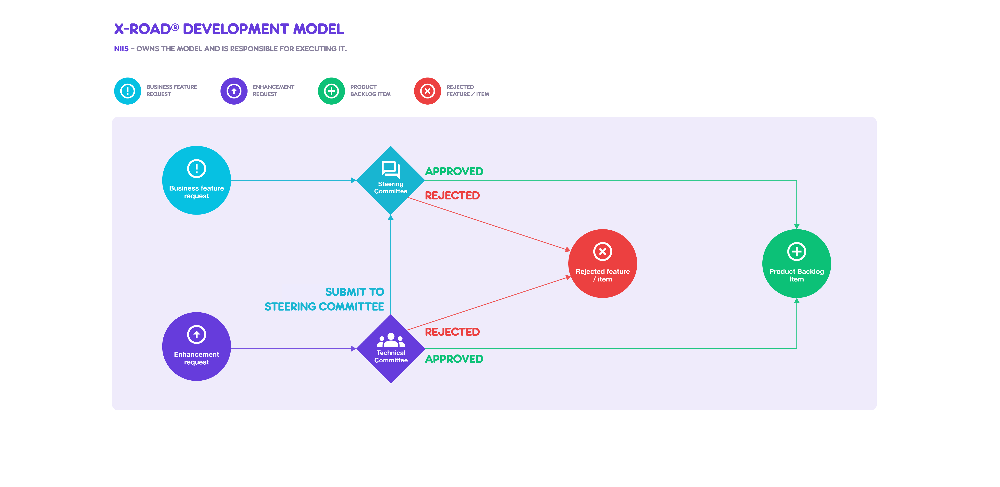

# X-Road Development Model

#### VERSION CONTROL
| version no.	 | what has been done	| date/person
| -- | ---- | ---- |
| 0.1	| Initial draft.	| 20.4.15 / PK
| 0.2	| Updated according to comments received in EE-FI telco on 27.4.2015	| 4.5.15 / PK
| 0.9	| Approved for piloting in Steering Committee meeting on 8.6.2015	| 13.6.15 / PK
| 0.91 | Updated according to comments received in EE-FI F2F meeting on 7.7.2015 in Helsinki	| 9.7.15 / PK
| 0.92 | Updated version numbering and SC tasks	| 6.10.15 / OK
| 0.93 | Changed document name to Charter, removed details described in the Workflow document, refences section added	|  22.12.15 / PK
| 0.94 | Conversion to Markdown, moved to xroad-joint-development repo | 25.01.16 / PP
| 0.95 | Vendor suffix principles added to versioning | 05.04.16 / OK
| 1.0 | Working Group role added | 14.12.16 / OK
| 1.9	| Copied from X-Road Joint Development [repository](https://github.com/vrk-kpa/xroad-joint-development) and renamed document from [Charter](https://github.com/vrk-kpa/xroad-joint-development/blob/master/CHARTER.md) to X-Road Development Model.	| 17.3.18 / PK
| 2.0 | Document updated to match the NIIS operating model. Changes approved by the Working Group. | 25.5.18 / PK
| 2.01 | Added links to [Product Backlog](https://nordic-institute.atlassian.net/browse/XRDDEV) and instructions how to [submit](README.md#enhancement-requests-and-error-reports) business feature and enhancement requests. | 31.5.18 / PK
| 2.02 | Add licence. Update section [3.4 Publish](#34-publish). | 22.11.20 / PK
| 2.03 | Update diagrams. | 26.12.20 / PK
| 2.1 | Update roles and responsibilities, and diagrams. | 16.06.23 / PK

## Licence

This document is licensed under the Creative Commons Attribution-ShareAlike 3.0 Unported Licence. To view a copy of this licence, visit http://creativecommons.org/licenses/by-sa/3.0/

## Table of contents

- [Licence](#licence)
- [1 General](#1-general)
- [2 Roles and Responsibilities](#2-roles-and-responsibilities)
- [3 Change Management](#3-change-management)
  * [3.1 Evaluate](#31-evaluate)
  * [3.2 Prioritize](#32-prioritize)
  * [3.3 Develop](#33-develop)
  * [3.4 Publish](#34-publish)
    * [3.4.1 Version Compatibility](#341-version-compatibility)
- [4 Warranty](#4-warranty)

## 1 General

The purpose of this document is to describe the change management process of the X-Road open-source software. The process
must ensure the quality of the source code, the application of best practices and the ability to manage software
changes to be applied to local production environments. The process is controlled by the Nordic Institute for 
Interoperability Solutions (NIIS).

Non-Functional Requirements are described in the [X-Road Non-Functional Requirements](NFR.md) document. The workflow policy based on this document is described in the [Workflow Policy](WORKFLOW.md) document.

## 2 Roles and Responsibilities

The change management process includes the following roles and responsibilities:

* NIIS
  * maintains [product roadmap](https://x-road.global/development-roadmap) and [product backlog](https://nordic-institute.atlassian.net/browse/XRDDEV)
  * maintains the [master](https://github.com/nordic-institute/X-Road) source code repository
  * maintains [Non Functional Requirements](NFR.md)
  * [reviews](WORKFLOW.md#12-submitting-and-accepting-work) and approves / rejects contributions
  * organizes and facilitates Steering Committee, Technical Committee and X-Road Community Expert Group meetings
  * schedules releases
  * coordinates daily work
* NIIS Member
  * nominates representatives to the Steering Committee and Technical Committee
  * [submits](README.md#enhancement-requests-and-error-reports) business feature and enhancement requests
  * [submits](WORKFLOW.md#12-submitting-and-accepting-work) code contributions including required documentation
* Steering Committee  
  * approves product strategy and budget
  * prioritizes product roadmap
  * [approves / rejects](DEVELOPMENT_MODEL.md#31-evaluate) business feature requests
* Technical Committee
  * prioritizes [product backlog](https://nordic-institute.atlassian.net/browse/XRDDEV)
  * [approves / rejects](DEVELOPMENT_MODEL.md#31-evaluate) enhancement requests
  * approves technical decisions
* X-Road Community Expert Group
  * participates in technical discussion
  * provides community input
* X-Road Community
  * [submits](https://github.com/nordic-institute/X-Road/blob/develop/CONTRIBUTING.md#submitting-an-enhancement-request) business feature and enhancement requests
  * [submits](https://github.com/nordic-institute/X-Road/blob/develop/CONTRIBUTING.md#submitting-a-pull-request) code contributions including required documentation.

## 3 Change Management

The **Product Roadmap** is a plan that outlines the flow of new business features
needed to satisfy the needs of the NIIS members. The Product Roadmap helps reach a
consensus about future developments and it provides a framework to help plan
and coordinate upcoming releases. The Product Roadmap takes into consideration
scoped functionality and X-Road production compatibility. Changes to the Product
Roadmap are approved by the Steering Committee.

The **[Product Backlog](https://nordic-institute.atlassian.net/browse/XRDDEV)** contains fine-grained 
technical items derived from the Product Roadmap items and enhancement
requests. The [Product Backlog](https://nordic-institute.atlassian.net/browse/XRDDEV)
is prioritized by the Technical Committee.

X-Road Product Roadmap and [Product Backlog](https://nordic-institute.atlassian.net/browse/XRDDEV)
are owned and managed by the NIIS.

*Diagram 1. The approval process of enhancement requests and business feature requests.*

The change management process consists of four phases:

* **evaluate** - collect new feature and enhancement requests and select the best ones for development
* **prioritize** – maintain and prioritize [product backlog](https://nordic-institute.atlassian.net/browse/XRDDEV)
* **develop** – agile development of features requested by the NIIS members
* **publish** – publish and distribute new releases.

*Diagram 2. The change management process.*

### 3.1 Evaluate

The NIIS members and X-Road Community may
[submit](https://jira.niis.org/servicedesk/customer/portal/1) business feature
requests and enhancement requests that are evaluated by the Technical Committee.
Business feature requests are about adding a new feature to X-Road core and
enhancement requests are about improving existing functionality. New business
feature requests are submitted to the Steering Committee for approval.

Requests must be aligned with the X-Road Product Roadmap. Otherwise, the requests
are either rejected or submitted to the Steering Committee for approval. In addition, 
the requests that are too costly, not really essential, etc. are eliminated. The requests 
that pass the evaluation enter the [Product Backlog](https://nordic-institute.atlassian.net/browse/XRDDEV).

### 3.2 Prioritize

[Product Backlog](https://nordic-institute.atlassian.net/browse/XRDDEV) is a prioritized
list of requests that have passed the evaluation. However, requests can also be
eliminated from the Product Backlog. During prioritize phase requests are
defined in more detailed level and they are broken down into technical items.
Dependencies between different items are analyzed and documented, and
prioritization is updated accordingly. Items on top of the backlog are the
top candidates for entering the sprint backlog of the next sprint. The NIIS is
responsible for maintaining the Product Backlog and prioritizing it together
with the Technical Committee.

### 3.3 Develop

Items are implemented in sprints using agile software development methods. Each
sprint, the implemented items are picked from the Product Backlog on top of its
stack. The development is done by the NIIS and the development
practices of the NIIS are followed ([Workflow Policy](WORKFLOW.md),
[NFR](NFR.md)). The NIIS is responsible for managing and coordinating the daily
work of the development teams.

In addition, the NIIS Members and X-Road community may contribute to the
development. Also then, the NIIS’s development practices must be followed
([Workflow Policy](WORKFLOW.md), [NFR](NFR.md)). The contributions must be
approved upfront by the Technical Committee and they must fulfil the [acceptance
criteria](https://github.com/nordic-institute/X-Road/blob/develop/CONTRIBUTING.md#pull-request-checklist) for contributions.

### 3.4 Publish

New versions of X-Road are published approximately two or three times a year, for example:

* winter
* spring
* autumn.

[Semantic versioning](http://semver.org/) scheme is used for software versions.
A basic software rule of thumb will be as follows.

*	Major Release (X) will be used for significant jumps in functionality such
as changing the framework which could cause incompatibility with interfacing
systems or new modules/components.
*	Minor Release (X.X) will be used when only minor features or significant
fixes have been added in a backwards-compatible manner.
*	Patch Release (X.X.X) is used and incremented when minor bugs are fixed in a
backwards-compatible manner.

At times, the release sequence may jump multiple minor versions at a time to
indicate significant features have been added, but are not enough to warrant
incrementing a major version number.

*Diagram 2. Distribute release versions.*

The NIIS is responsible for publishing new versions and distributing installation
packages to the NIIS Members and X-Road Community. The NIIS Members and X-Road
Community are responsible for updating their instances and coordinating the
upgrade process within their ecosystems.

Latest version and two earlier versions of the X-Road are officially supported
by the NIIS. The supported versions are defined on `MAJOR`.`MINOR` level so the
release of patch versions (`MAJOR`.`MINOR`.`PATCH`) does not effect on the support.

#### 3.4.1 Version Compatibility

Major versions of X-Road are intended to be longlived versions of the software
which consist of numerous minor versions. The decision to create a new major
version of X-Road will be the result of the need for major changes which cannot
be successfully implemented without breaking version compatibility.

## 4 Warranty

The NIIS is responsible for fixing software errors detected in the X-Road core
and providing second level support to the NIIS Members.
