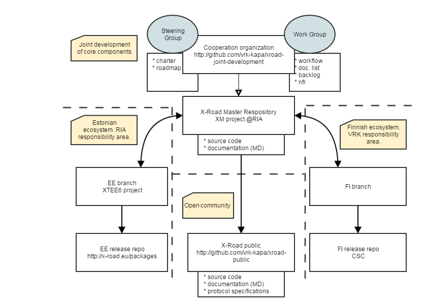

# Example Markdown Document

Version: 1.0.1  
Doc. ID: UG-EXAMPLEMD  

| Date       | Version     | Description                                     | Author             |
|------------|-------------|-------------------------------------------------|--------------------|
| 13.01.2017 | 1.0.0       | Initial version                                 | Vitali Stupin      |
| 13.01.2017 | 1.0.1       | Fixed some typos                                | Vitali Stupin      |
| 20.01.2017 | 1.0.2       | Fixed some typos                                | Vitali Stupin      |

## Table of Contents

[Table of Contents](#table-of-contents)  
[License](#license)  
[1 Introduction](#1-introduction)  
&nbsp;&nbsp;&nbsp;&nbsp;[1.1 Terms and Abbreviations](#11-terms-and-abbreviations)  
&nbsp;&nbsp;&nbsp;&nbsp;[1.2 References](#12-references)  
[2 Examples](#2-examples)  
[Annex A Example XML](#annex-a-example-xml)  

## License

This work is licensed under the Creative Commons Attribution-ShareAlike 3.0 Unported License.
To view a copy of this license, visit http://creativecommons.org/licenses/by-sa/3.0/.

## 1 Introduction

This is an example GitHub Flavored Markdown document \[[GITHUBMD](#Ref_GITHUBMD)\] used to illustrate X-Road joint development
"Formatting & Style Guide" \[[STYLEGUIDE](#Ref_STYLEGUIDE)\].

Document creators SHOULD view this example markdown before writing any X-Road documentation
and MAY use this example as a template for new documents.

The key words "MUST", "MUST NOT", "REQUIRED", "SHALL", "SHALL NOT", "SHOULD", "SHOULD NOT", "RECOMMENDED", "MAY", and "OPTIONAL"
in this document (in uppercase, as shown) are to be interpreted as described in \[[RFC2119](#Ref_RFC2119)\].

### 1.1 Terms and Abbreviations

- **X-Road member** – natural or legal person who uses functionality offered by X-Road.

- **Subsystem** – represents part of an information system belonging to an X-Road member.
X-Road member can divide its information system to subsystems, although this is not mandatory

- **X-Road service** – SOAP-based web service that is offered by an X-Road member or by a subsystem
and that can be used by other X-Road members or subsystems.

- **XML** - stands for eXtensible Markup Language.

### 1.2 References

<a id="Ref_STYLEGUIDE"></a>\[STYLEGUIDE\] X-Road joint development Formatting & Style Guide, 2016,  
[FormattingStyleGuide.md](FormattingStyleGuide.md)

<a id="Ref_RFC2119"></a>\[RFC2119\] Key words for use in RFCs to Indicate Requirement Levels, Internet Engineering Task Force, 1997.

<a id="Ref_GITHUBMD"></a>\[GITHUBMD\] GitHub Flavored Markdown,  
https://guides.github.com/features/mastering-markdown/.

## 2 Examples

Note that GutHub will automatically detect fully qualified links. So the following lines of code will produce the same result:
```
https://guides.github.com/features/mastering-markdown/
```
https://guides.github.com/features/mastering-markdown/

```
[https://guides.github.com/features/mastering-markdown/](https://guides.github.com/features/mastering-markdown/)
```
[https://guides.github.com/features/mastering-markdown/](https://guides.github.com/features/mastering-markdown/)

Be careful with long lines in code blocks. Triple back ticks (\`\`\`) disable wrapping:
```
This work is licensed under the Creative Commons Attribution-ShareAlike 3.0 Unported License. To view a copy of this license, visit http://creativecommons.org/licenses/by-sa/3.0/.
```

Example image:


## Annex A Example XML

This section contains example XML with highlighting.

```xml
<?xml version="1.0" encoding="UTF-8"?>
<note>
  <to>Tove</to>
  <from>Jani</from>
  <heading>Reminder</heading>
  <body>Don't forget me this weekend!</body>
</note>
```
