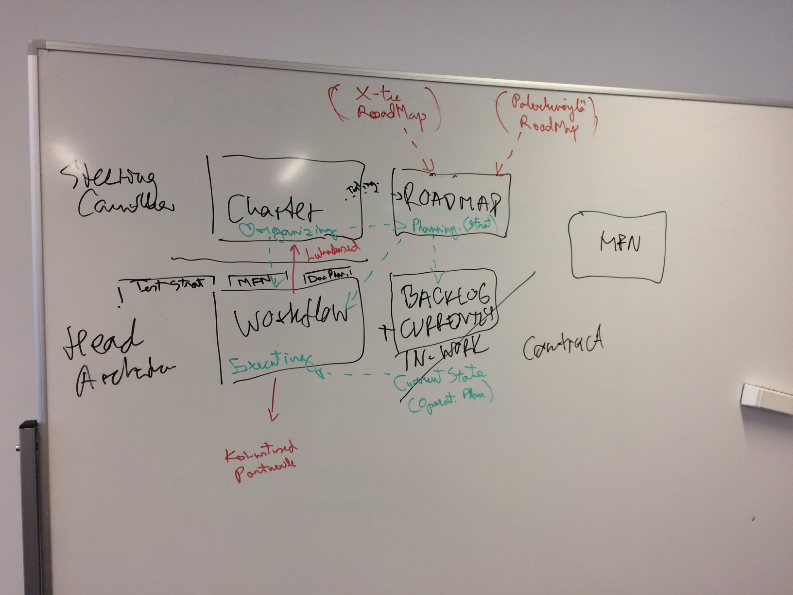

# X-Road Joint Development

This repository is used to store the originals of X-Road joint development work agreements and regulations. It is also used to manage changes to these documents.

- [Charter](CHARTER.md)
- [Workflow](WORKFLOW.md)
- [NFR (Non-functional requirements)](NFR.md)
- [Backlog](BACKLOG.md)

### How do the documents relate to each other?
Sketch of the 'Big Picture':

### How to contribute?
Submit a pull request or raise an issue. Changes to the documents are reviewed in EE-FI workgroup meetings and/or e-mail and/or issue comments in this repository. 

Head Architect decides on submitted changes.
