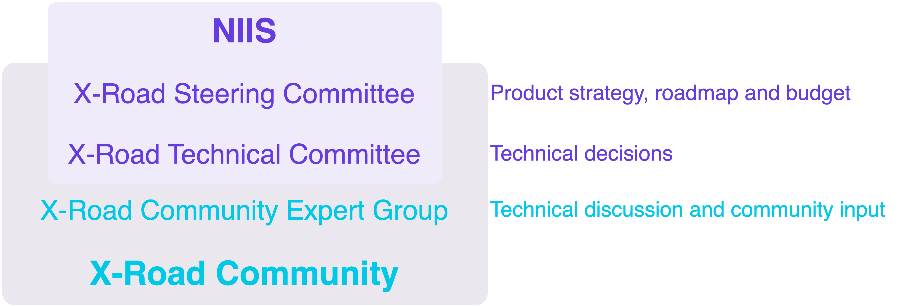

# X-Road Development

This repository is used for storing X-Road development model, and
documentation regarding common development practices and guidelines.
It is also used for managing changes to these documents.

- [Development Model](DEVELOPMENT_MODEL.md)
- [Workflow](WORKFLOW.md)
- [NFR (Non-functional requirements)](NFR.md)

### X-Road Development 'Big Picture'

The [Nordic Institute for Interoperability Solutions](https://niis.org) (NIIS)
owns the X-Road product and maintains Product Roadmap and Product Backlog. The
NIIS is responsible for:

* management, development, verification, and audit of the source code
* administration of documentation
* administration of business and technical requirements
* conducting development, and managing development tools, platforms and practices
* developing and implementing principles of licensing and distribution
* providing second-line support to NIIS members.

The **[NIIS Members](https://www.niis.org/organization-and-management/)**
nominate representatives to the **Advisory Group** and participate in the
**Working Group**. The NIIS organizes and facilitates Advisory Group and
Working Group meetings.

### X-Road Community

X-Road is released under the [MIT](https://en.wikipedia.org/wiki/MIT_License)
license and is available free of charge for any individual or organization.
More information about the X-Road Community can be found
[here](https://community.niis.org).

### How to contribute?

All contributions are warmly welcome. Submit a pull request, enhancement request,
error report or propose a change to the [Workflow](WORKFLOW.md). Requests are
reviewed in Working Group meetings and/or e-mail and/or issue comments.

#### Pull requests

Pull requests can be submitted following the process described in the
[Workflow](WORKFLOW.md#12-submitting-and-accepting-work).

#### Enhancement requests and error reports

X-Road enhancement requests and error reports can be submitted to the [X-Road Service
Desk](https://jira.niis.org/servicedesk/customer/portal/1).
[Sign up](https://jira.niis.org/secure/Signup!default.jspa) for an account and
get access to the [X-Road Service
Desk](https://jira.niis.org/servicedesk/customer/portal/1) and
[X-Road Backlog](https://jira.niis.org/projects/XRDDEV/).

#### Security issues and vulnerabilities

Security issues and vulnerabilities are reported privately to the [X-Road Service
Desk](https://jira.niis.org/servicedesk/customer/portal/1) using the
`Report a software problem` request type.
[Sign up](https://jira.niis.org/secure/Signup!default.jspa) for an account and
get access to the [X-Road Service Desk](https://jira.niis.org/servicedesk/customer/portal/1).

#### Changes to the workflow

If you want to propose a change to the documents in this repository, please
[submit](https://github.com/nordic-institute/X-Road-development/issues/new) an
issue using the GitHub issue tracker.

#### Contributor License Agreement

We appreciate community contributions to X-Road open source code repositories
managed by NIIS. By signing a [contributor license agreement](https://en.wikipedia.org/wiki/Contributor_License_Agreement),
we ensure that the community is free to use your contributions.

##### Review the CLA document

The NIIS Contributor License Agreement (CLA) document is available for review as
a [Word](docs/NIIS_Contributor_Licence_Agreement.docx) and
[PDF](docs/NIIS_Contributor_Licence_Agreement.pdf) document.

##### Sign the CLA

When you contribute to X-Road open source project on GitHub with a new pull
request, it will be checked whether you have signed the CLA. If required, the
pull request will be commented on with further instructions. The CLA must be
received by NIIS prior to approval of the pull request. The CLA covers any and
all submissions that the contributor now, or in the future, submits to the
project. Therefore, it is enough to sign the CLA once before the first
contribution, and not with every contribution.

The CLA can be signed digitally using a
[qualified electronic signature](https://ec.europa.eu/cefdigital/wiki/display/SDBX/Introduction+to+e-signature).
A digitally signed CLA must be emailed to `info@niis.org`.

Alternatively, the CLA can be printed out, signed manually and sent to NIIS
by post:

    MTÜ Nordic Institute for Interoperability Solutions
    Hobujaama 4
    10151 Tallinn
    Estonia

### Development Tools

The tools listed below are used in the development of the X-Road.

| URL | Description |
| --- | --- |
| https://jira.niis.org/projects/XRDDEV/ | X-Road backlog. |
| https://jira.niis.org/servicedesk/customer/portal/1 | X-Road Service Desk for submitting enhancement requests and error reports. |

[Sign up](https://jira.niis.org/secure/Signup!default.jspa) for an account and
get access to the tools.

### Source code

The X-Road core source code master repositories are listed below.

| Repository | Description |
| --- | --- |
| [nordic-institute/X-Road](https://github.com/nordic-institute/X-Road) | X-Road development repository. |
| [nordic-institute/X-Road-tests](https://github.com/nordic-institute/X-Road-tests) | X-Road related tests. |
| [nordic-institute/X-Road-tests-environment](https://github.com/nordic-institute/X-Road-tests-environment) | X-Road test automation environment. |
