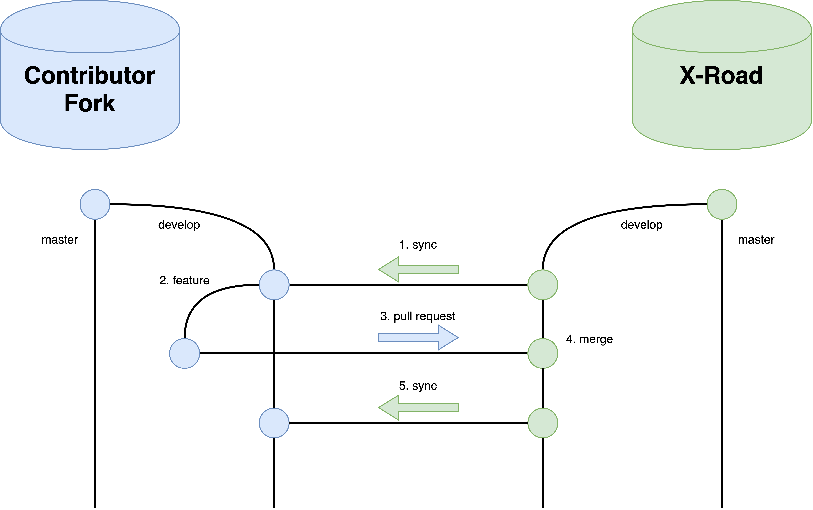

# Workflow Policy

#### VERSION CONTROL
| version no.	 | what has been done	| date/person
| ---- | ---- | ---- |
| 1.7	| Copied from X-Road Joint Development [repository](https://github.com/vrk-kpa/xroad-joint-development).	| 17.3.18 / PK
| 2.0 | Document updated to match the NIIS operating model. Changes approved by the Working Group. | 25.5.18 / PK
| 2.1 | Moved chapter 20 content to [TEST_WORKFLOW.md](TEST_WORKFLOW.md) document. | 31.5.18 / PK
| 2.2 | Added description of support branches | 13.2.18 / IS

## Table of contents

- [Workflow Policy](#workflow-policy)
      - [VERSION CONTROL](#version-control)
  - [Table of contents](#table-of-contents)
  - [1	General](#1-general)
  - [2 Related documents](#2-related-documents)
  - [3 Development model](#3-development-model)
  - [4	Repositories](#4-repositories)
  - [5	Branching pattern](#5-branching-pattern)
  - [6 Tagging](#6-tagging)
  - [7 Package naming](#7-package-naming)
  - [8 Changelog management](#8-changelog-management)
  - [9 Pull requests](#9-pull-requests)
  - [10 Work initiation](#10-work-initiation)
  - [11	Performing and integrating work](#11-performing-and-integrating-work)
  - [12 Submitting and accepting work](#12-submitting-and-accepting-work)
  - [13	Release preparation](#13-release-preparation)
  - [14	Deployment](#14-deployment)
  - [15	Hotfix](#15-hotfix)
  - [16	Setting up repositories](#16-setting-up-repositories)
  - [17	Open source development](#17-open-source-development)
  - [18	Documentation policy](#18-documentation-policy)
  - [19	Approval, publication and amendment](#19-approval-publication-and-amendment)
  - [20 Testing](#20-testing)

## 1	General

1.1	This document establishes workflow policy for the development of the X-Road
core. Workflow Policy strives to serve as a handbook for all practical
aspects of the development.

1.2	Workflow is understood as systematic arrangement of work, a complex of
processes, practices, roles and responsibilities, communication patterns, and
artefacts.

1.3	Goals of the workflow policy are to
- establish productive and secure collaborative open source working environment
- assure production of high quality software
- avoid duplication of effort, facilitate re-use of software
- transparency and openness
- broader community of developers
- use of software development best practice
- clear communication among all the parties in the X-Road development process
- innovation.

1.4 This policy uses terminology of [X-Road Development Model](https://github.com/nordic-institute/x-road-development/blob/master/DEVELOPMENT_MODEL.md).

1.5 All the parties participating in the X-Road development must follow this
policy. This applies to the NIIS, the NIIS Members and X-Road community. In
case development work is ordered from a third party the organization conducting
the development is responsible for the inclusion of appropriate stipulations
in the contracts between the Contracting Party and the Vendor.

1.6 The NIIS, the NIIS Members and X-Road community implement this policy in good
faith and in the context of sustainable, good software development practice.

1.7 Projects may have their own workflow arrangements as far as these do not
contradict this policy.

1.8 In this document the NIIS Members and their contractors, and
X-Road community are referred as **Contributors**.

## 2 Related documents

2.1 Workflow policy is related to other X-Road development guidelines and regulations:
- workflow policy implements the [X-Road Development Model](https://github.com/nordic-institute/x-road-development/blob/master/DEVELOPMENT_MODEL.md)
- technical consistency of X-Road software is maintained with help of [X-Road Non-Functional Requirements](https://github.com/nordic-institute/x-road-development/blob/master/NFR.md).

See also other documentation in [X-Road Development](https://github.com/nordic-institute/x-road-development/) repository.

## 3 Development model

3.1	X-Road uses [Github](https://github.com/) and [Git](https://git-scm.com/)
based version management. In general the workflow policy follows Atlassian [Gitflow](https://www.atlassian.com/git/tutorials/comparing-workflows#gitflow-workflow)
scheme.

* The NIIS developers are working directly in the `nordic-institute/X-Road` main
repository.
* The NIIS Members may choose to work directly in the `nordic-institute/X-Road`
main repository or in their own forked repository.
* X-Road community members work in their own forked repositories.

The main forks at the time being are `vrk-kpa/X-Road` and `ria-ee/X-Road`. [Semantic versioning](http://semver.org/) scheme is used for software versions.

## 4	Repositories

4.1	The following code and documentation repositories are used:

- Master Repository - short name: `nordic-institute/X-Road`; hosted by: GitHub; managed by: NIIS;
purpose: development and release of X-Road software; access: NIIS has write access; read access: ALL.
- Master Test Repository - short name: `nordic-institute/X-Road-tests`; hosted by: GitHub; managed
by: NIIS; purpose: development and release of X-Road automated tests; access: NIIS has write
access; read access: ALL.
- Contributor repositories - purpose: development work carried out by
Contributor; administered by: Contributor.

4.2	The Contributors can establish their own, additional repositories, for backup,
software distribution or other purposes.

## 5	Branching pattern

5.1	Branching pattern follows the [Gitflow model](https://www.atlassian.com/git/tutorials/comparing-workflows/gitflow-workflow). Two perpetual branches – `master` and `develop` – together with three additional branches – `feature`, `release` and `hotfix` – are used. In addition `support` branches are used for maintaining old releases.

- `master` branch is used to release X-Road software into production
- `develop` branch is used to accumulate features for the next big release
- `feature` branches are used to work on features (or closely related sets of features) to enhance X-Road core software
- new production release is prepared on `release` branch
- patches are prepared on `hotfix` branches.
- `support` branch is created when an old release needs to be patched

## 6 Tagging

6.1 The versions merged to `X-Road/master` branch are tagged with annotated tags. E.g.

`git tag -a 6.7.12 -m "X-Road 6.7.12"`

The versions merged to `X-Road/develop` branch are not tagged.

## 7 Package naming

7.1 There are development versions and release versions and their package naming format is different.

7.2 The development package name format is `X.Y.Z-R.YYYYMMDDHHMMSSgitAAAAAA` (e.g. xroad-securityserver_6.14.0-0.20170428110816gitfbe4542_all.deb and xroad-securityserver-6.14.0-0.20170428110816gitfbe4542.el7.noarch.rpm)
- The software version X.Y.Z: X=major, Y=minor, Z=patch, e.g. 6.7.1
- R=package release number. For development versions this should be set to 0.
- YYYYMMDDHHMMSS = git commit timestamp (UTC) and AAAAAA = git commit hash (git show -s --format=%h)
  - The purpose of the timestamp is to ensure that packages will update although the software version number is not changed
  - Commit hash can be used to help working out from which commit the packages are made of

7.3 The release package name format is `X.Y.Z-R` (e.g. xroad-securityserver_6.14.0-1_all.deb and xroad-securityserver-6.14.0-1.noarch.rpm)
- R=package release number. If there is no specific reason to set otherwise, for release versions it should be equal to 1 (debian/rhel convention)
  - Specific reason to raise the package release number could be a bug in packaging when the software version doesn't change, only packaging. When the software version changes, the package release number is set back to 1.

## 8 Changelog management

8.1 The main changelog of the application is in [CHANGELOG.md](https://github.com/nordic-institute/X-Road/blob/develop/CHANGELOG.md) and it contains all software changes. The changelog entry format is

```
 ## X.Y.Z - YYYY-MM-DD
- ISSUE: Description.
```

For example

```
 ## 6.12.0 - 2017-03-13
- XTE-99 / Joint development issue #79: Security Server UI: Added uniqueness check of the entered security server code when initializing the server.
- XTE-252 / Joint development issue #53: Security Server: Upgraded embedded Jetty to the version 9.4.2. Due to upgrade SHA1 ciphers are no longer supported for communication between security server and client.
- XTE-293: Security Server: A field set used to generate the token ID of the SSCD has been made configurable.
- XTE-294 / Joint development issue #84: Security Server: Added configuration file for the OCSP responder Jetty server (and increased max threads size of the thread pool).
- XTE-307 / Joint development issue #131: Security Server bugfix: Added missing HTTP header "Connection: close" into the server proxy response in cases error occurs before parsing a service provider's response.
- XTE-308 / Joint development issue #132: Security Server bugfix: Added missing read timeout for OCSP responder client.
- XTE-310 / Joint development issue #125: Security Server bugfix: SOAP messages with attachments caused in some cases a temopray file handle leak.
- XTE-333 / Joint development issue #128: Security Server bugfix: Fixed parsing SOAP messages containing &amp; or &lt; entities.
- Security Server: TCP socket SO_LINGER values in the proxy configuration file (proxy.ini) set to -1 according to avoid unexpected data stream closures.
```

Debian packaging has its own changelogs in `src/packages/xroad/debian/changelog` and `src/packages/xroad-jetty9/debian/changelog` but these are not used to record changelog entries since these are already in [CHANGELOG.md](https://github.com/nordic-institute/X-Road/blob/develop/CHANGELOG.md), only to set the Debian package version. I.e. the following Debian changelog is sufficient.

```
xroad (6.14.0-0) trusty; urgency=medium
  * Change history is found at /usr/share/doc/xroad-securityserver/CHANGELOG.md
-- Jarkko Hyöty <jarkko.hyoty@gofore.com> Tue, 11 Apr 2017 15:46:12 +0300
```

## 9 Pull requests

9.1 Pull requests made against the `X-Road/develop` branch MUST follow these conventions
- Pull request name format is `contributor-version-sequence` e.g. Finnish-6.15.0-3
  - Contributor=origin of the pull request
  - Version=version of the software this pull request is intended for
  - Sequence=sequence number of the pull request. There can be multiple pull requests aiming for the same release and the sequence distinguishes between these.
- Description field must contain at least the changelist. Any relevant additional information should also be provided here.

Release and hotfix pull requests made against `master` branch must follow these conventions
- Pull request name format is just `version` e.g. 6.15.0
- Description field must contain at least the changelist. Any relevant additional information should also be provided here.

9.2 To ease the review work and to make clearer what changes are done, the following guidelines are required:

- Separate commits MUST be made for every bug fix included to pull request
- Separate commits SHOULD be made for every feature included to pull request

One pull request can contain several bug fix or feature commits. However, pull requests containing critical production related bug fixes should be keep simple to make reviewing easier.

9.3 For commit messages the following format SHOULD be used:

`ISSUE-111: Fix typo in security server user guide`

## 10 Work initiation

10.1 New development is initiated by preparing an enhancement request. The
request is submitted for review and approval to X-Road Working Group, according
to the procedure in [X-Road Development Model](https://github.com/nordic-institute/x-road-development/blob/master/DEVELOPMENT_MODEL.md#31-evaluate), section "Evaluate".

10.2 The NIIS coordinates development by the X-Road Product Roadmap. Approved
request will be entered into the Product Roadmap. Dependencies and effects to
other components of the X-Road core and related projects must be analysed in
preparing of requests.

10.3	New features are always developed on `feature` branches.

Procedure:
- Contributor creates its own repository by forking `X-Road`
- `feature` branch is created by branching from `develop`

## 11	Performing and integrating work

11.1 The X-Road core is developed by the NIIS and the Contributors. The Contributors have
forked X-Road and the development work is done in the fork. The NIIS coordinates
towards a common release and the Contributors integrate their work to the main
repository. Contributor is required to periodically fetch updates from
`nordic-institute/X-Road/develop` and integrate changes into Contributor's branch as described
in [Github's documentation](https://help.github.com/articles/syncing-a-fork/).
The purpose of this is to facilitate merging of Contributor's work into
`nordic-institute/X-Road/develop`.

11.2 It is the responsibility of the Contributor to follow the X-Road Product
Roadmap and react to changes that might affect the scope of the Contributor's
development work.

## 12 Submitting and accepting work

12.1 Upon completion of feature development, Contributor [submits a pull request](https://help.github.com/articles/creating-a-pull-request-from-a-fork/)
to `nordic-institute/X-Road/develop`. Prior to submitting the request Contributor
must [fetch the most recent updates](https://help.github.com/articles/syncing-a-fork/)
from `nordic-institute/X-Road/develop` and integrate the changes into
Contributor's branch (solve conflicts, if any). In practise, when integration
is due a `release` branch is forked out of `develop` in the Contributor's fork.
In the `release` branch the code is developed and tested until it is ready to be
taken forward. Once the code is ready a pull request is made from the fork's
`release` branch to the `nordic-institute/X-Road/develop` branch as described
in the [Github documentation](https://help.github.com/articles/creating-a-pull-request-from-a-fork/).
If defects are found in the pull request review they are fixed in the fork's
`release` branch and the Github pull request updates automatically. When the
pull request is eventually accepted to `nordic-institute/X-Road/develop` the
changes are synced back to fork's `develop` as described in the [Github documentation](https://help.github.com/articles/syncing-a-fork/).



12.2	The pull request is reviewed by the NIIS. Additional reviewers can be
added as necessary. The pull request is reviewed according to the acceptance
criteria that was in effect when the work on this changeset started.

12.2.1 Feature analysis

- Are the features OK to be accepted to the core?
- The feature should come through the change management process and be accepted
by the NIIS

12.2.2 Source code

- Is the source code for the software and its dependencies available?

12.2.3 Non-functional requirements

- Does the code conform to the X-Road non-functional requirements (see [X-Road Non-Functional Requirements](https://github.com/nordic-institute/x-road-development/blob/master/NFR.md))?

12.2.4 Version number

- Is the version number format correct (see [X-Road Development Model](https://github.com/nordic-institute/x-road-development/blob/master/DEVELOPMENT_MODEL))?
- Is the version number correct (as agreed on the Roadmap)?

12.2.5 CI build & tests

- No merge conflicts?
- Does the build and the test cases work?
- Does the packaging work (Ubuntu & RHEL)?
- Can the software be installed on a clean system (Ubuntu & RHEL)?
- Can the software version be upgraded from two previous `nordic-institute/X-Road/master` version?

12.2.6 SonarQube (LTS) static analysis

- Is there enough test coverage? The test coverage should be equal or higher
than in the previous version.
- SonarQube shows no bugs or code smells of severity blocker or critical? The
developer has a chance to comment the issues before accept/reject action.

12.2.7 Changelogs

- Have the changelogs been updated and include the changes made?
- The changelog items contain reference to the backlog item where applicable?

12.2.8 Licensing

- Is the code licensing OK?

12.2.9 Documentation

- Has the documentation been updated?
- Is the documentation in correct format as specified in [X-Road Formatting & Style Guide](https://github.com/nordic-institute/x-road-development/blob/master/FormattingStyleGuide.md)? Are the sources of pictures provided?

12.3 Pull requests are generally reviewed and accepted on first-come,
first-served (FCFS) basis.

12.4 If acceptance criteria is not met, then Contributor is requested to bring
submitted work up to acceptance requirements.

12.5 The NIIS can hold up acceptance of new pull requests from other Contributors,
to allow a specific Contributor fix the deficiencies found in submitted work.

12.6 When the changeset meets the acceptance criteria and all the reviewers
have accepted the work, then the NIIS pulls in and merges the work
into `nordic-institute/X-Road/develop`.

## 13	Release preparation

13.1	New versions of X-Road are published three times a year based on a fixed
release schedule. Releases are always prepared in the X-Road core master
repository `nordic-institute/X-Road`.

First a `release` branch is forked from the `develop` branch and pull request
is made against `nordic-institute/X-Road/master`. The version in the `release`
branch is then exhaustively tested and fixes are made when necessary. When the
version in the `release` branch meets the acceptance criteria the `release`
branch is merged into `master` and back into `develop`.


13.2	X-Road is released by the procedure:

-	The NIIS creates a `release` branch from `develop` and makes a pull
request against `nordic-institute/X-Road/master`.
- The NIIS thoroughly reviews the software to be released.
- The NIIS decides to release, including the version number (see [X-Road Development Model](https://github.com/vrk-kpa/xroad-joint-development/blob/master/CHARTER.md), sections “Publish” and “Version compatibility”).
- The NIIS merges the pull request from `release` branch into
`nordic-institute/X-Road/master` and tags the commit with version number.
- The NIIS also updates `nordic-institute/X-Road/develop` with changes made
on `release` branch.

## 14	Deployment

14.1	The Contributors can fetch the released software into their own repositories.
The contributor repositories serve as distribution points for Contributors'
ecosystems.

## 15	Hotfix

15.1	Critical bug in production version is handled by preparation and release of a patch (see [X-Road Development Model](https://github.com/nordic-institute/x-road-development/blob/master/DEVELOPMENT_MODEL), section “Warranty”).
Hotfixes are always prepared in the X-Road core master repository
`nordic-institute/X-Road`.

15.2	The NIIS prepares a patch on `hotfix` branch forked from the `master` branch.


15.3	When the fix is ready a pull request is made against the
`nordic-institute/X-Road/master` branch. If defects are found in the pull
request review they are fixed in the `hotfix` branch. After the pull request
has been accepted the changes can be merged into both
`nordic-institute/X-Road/master` and `nordic-institute/X-Road/develop`.
In addition, `nordic-institute/X-Road/master` must be tagged with an updated
version number.

15.4 Hotfix can also be made for `develop` branch the same way as described for
`master` branch above. This situation is possible if after an integration made
to `nordic-institute/X-Road/develop` branch a Contributor requests a fix/change to previous.

15.5 When an old release needs to be patched NIIS prepares a patch on `support` branch forked from the relevant release tag on the `master` branch. The necessary commits are made and finally the released version is tagged in the `support` branch.

## 16	Setting up repositories

16.1	Repositories are set up according to the process:

- The NIIS sets up the Master Repository `X-Road`. Repository is initialised
by committing X-Road v6.0 software into the `master` branch.
- The NIIS creates `develop` branch in `X-Road`.

## 17	Open source development

17.1	Open source development and the development conducted by the NIIS Members
are only loosely coupled. Master Repository `nordic-institute/X-Road` is open
to everybody for forking. The NIIS administers the Master Repository
`nordic-institute/X-Road`.

17.2	New branches are created in `nordic-institute/X-Road` by the NIIS as needed.

17.3	Pull requests into `nordic-institute/X-Road` are reviewed and accepted
by the NIIS.

17.4	Good quality and useful results of open source development can be
integrated into `nordic-institute/X-Road`. The X-Road change management
process is described in the [development model](DEVELOPMENT_MODEL.md).

## 18	Documentation policy

18.1	X-Road documentation is produced in English. Contributors are free to
translate documentation into other languages.

18.2	Production format for documentation is [GitHub Flavoured Markdown](https://help.github.com/articles/github-flavored-markdown/).

18.3 The documentation is written in [vanilla style](https://en.wikipedia.org/wiki/Vanilla_software).
In X-Road context it means that the NIIS Member specific customizations,
settings, repositories etc. need to stand out from documentation clearly. The
vanilla version of X-Road security server is installed with `xroad-securityserver`
package. The NIIS Member specific versions are installed with
`xroad-securityserver-XX` where XX is the country code of a NIIS Member.

18.4	Contributors may publish X-Road documentation on their own websites in
accordance with the [License](https://creativecommons.org/licenses/by-sa/3.0/).

## 19	Approval, publication and amendment

19.1	Workflow will be amended as needed. Amendments are guided by the goal of
having efficient and flexible workflow.

19.2  All participants of the development can propose to amend Workflow Policy.
Amendment proposal can be submitted by raising an issue or submitting a pull
request in GitHub.

19.3	The NIIS, upon consultation with the NIIS Members, when appropriate,
accepts or rejects the proposal.

19.4	Current version of Workflow Policy is made public in GitHub, https://github.com/nordic-institute/x-road-development/blob/master/WORKFLOW.md.

## 20 Testing

20.1. Current version of Test Workflow Policy is made public in GitHub at https://github.com/nordic-institute/x-road-development/blob/master/TEST_WORKFLOW.md.
